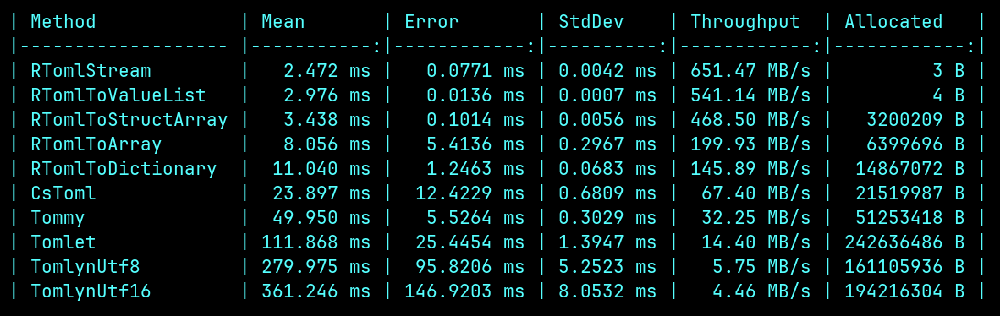

# Regular subset of [TOML](https://toml.io/en/)

<a href="https://www.nuget.org/packages/r-toml/"></a>

Features and non-features: 
- Simple **key-value** parser based on TOML spec (v1.0.0)
- Streaming: performs actions **during parsing**
- Zero-copy: **does not allocate memory** unless requested
- Stackless: collects absolutely **nothing on the stack**
- Automata based: **reliable** and **optimal** (see [benchmarks in F#](/src/r-toml.benchmarks/Program.fs) and [benchmarks in Rust](/benches/rust_benchmark.rs))
- Inlining: [inlines lambdas](/src/r-toml.benchmarks/disassembly.txt#L824) down at the call site, **no indirection** or virt-calls, no need to implement any interfaces.
- Single file with **no dependencies**: no bloat, no enterprise coding practices, no folder hierarchies with circular references, no third party supply chain attacks.
- Raw UTF8: no UTF16 conversion, runs on bytes directly

#### F# benchmarks

#### Rust benchmarks


### Spec and description: 

I very much like the TOML format for flat key-value storage and 
**for the features that are supported, it is fully compatible with TOML**.
This means you don't need to learn anything new and can use existing tooling
like strongly typed schemas in the editor.

The TOML format has a beautiful property that nested types can be expressed 
in a regular grammar, and this library takes advantage of that. It's been an experimental project on my shelf for a bit and there's still more things to add, but if you don't use any fancier features then it is usable already. Of course TOML was never meant to be a data storage format and this is misusing the original purpose but perhaps the fact that regular-toml can be parsed much faster may change your mind.

#### basic usage (F#)

```fsharp
let toml : byte[] = "
[server]
port = 8080
hostname = 'abc'
"B
let dictionary = RToml.toDictionary(toml)
dictionary["server.port"].kind          // INT
dictionary["server.port"].ToInt(toml)   // 8080

// or any of the other formats
let array = RToml.toArray(toml)
let array2 = RToml.toStructArray(toml)
let valuelist = 
    use vlist = RToml.toValueList(toml)
    for v in vlist do () //.. do something
// or iterate over the key-value pairs
RToml.stream (
    toml,
    (fun key value ->
        if value.kind = Token.TRUE then
            let keystr = key.ToString toml // struct to string
            printfn $"{keystr} at pos:{key.key_begin} is set to true"
    )
)
```
#### basic usage (Rust)
```rust
fn main() {
    let toml = b"
[server]
port = 8080
hostname = 'abc'
";
    let map = r_toml::to_map(toml).unwrap();
    dbg!(&map["server.port"].kind); // INT
    dbg!(&map["server.port"].to_int(toml)); // Ok(8080)

    // or iterate over key-value pairs
    let mut key_buf = Vec::new();
    r_toml::stream(toml, |k, v| {
        println!("{} = {:?}", k.to_str(&mut key_buf, toml), v.kind);
        key_buf.clear();
    });
}
```

#### Supported types: 

- keys and basic primitives: bool/int/float/string (including basic, literal and multiline strings) `true/false`,`10`,`0.005`, `'string'`
- datetime/datetimeoffset `1979-05-27T07:32:00Z`
- tables `[entry]`, `[entry.inner]`
- arrays of tables `[[products]]`
- typed arrays of basic primitives: bool[]/int[]/float[]/string[] `[1, 2, 3]`
- comments (only at beginning of line for now) `# comment`

#### Unsupported TOML types and features:

##### inline tables:
```toml
person = { address = { postcode = 123, street = "abc" } }
```
however you can do any of these 
```toml
person.address.postcode = 123
person.address.street = "abc"

[person]
address.postcode = 123
address.street = "abc"

[person.address]
postcode = 123
street = "abc"
```

##### deep and/or mixed arrays:
```toml
datapoints = [[[0,1,3],"abc"],{ x = 1, y = 2}]
```

##### Key types

There is one particular type of TOML key that is not supported:
```toml
"person"."address"."name"."this"."can"."be"."very"."long"
["person"."address"."name"]
[["person"."address"."name"]]
```

As it's unlikely to see quoted keys in most toml files,
**there is no support for quoted keys**.

The reason is that to parse this key there needs to be some form of conversion, collection or book-keeping
to extract the values inside the quotes. While this is entirely regular
and there's no problem actually reading this, 
this violates the Streaming, Zero-Copy, Stackless property as you need to 
separate the keys from the quotes somehow. 
Just a single quoted key is technically fine, that may be added some time.


#### String types

Whether a string contains an escape sequence is detected and added as a flag 
to the string, however there is no implementation to do the actual escaping 
right now, so if you use escape sequences you need to perform escaping yourself.

The string kinds after parsing are labeled as follows:
- `VALID_STR` : valid string, no post-processing needed
    - the span contains a valid string without any escape sequences 
    - for multiline strings the optional leading newline has already been trimmed
- `ESC_STR` : escape sequence detected
    - the span contains a valid string but contains escape sequences 
    - for multiline strings the optional leading newline has already been trimmed
- `EMPTY_STR`: the string is empty, this is just a special case to prevent redundant work

#### Array types

Based on an arbitrary decision, the only arrays supported are all of single type.
The parser returns the region where the values are, which have to be post-processed after.
The region itself is already validated to meet TOML spec, that is a token of one of the following types:

- `ARR1_STR`: 
    - valid comma separated input, all entries are strings
    - eg., `"asd", 'ghi', """123"""`
- `ARR1_INT`: 
    - valid comma separated input, all entries are integers
    - eg., `1, -2, +3`
- `ARR1_FLOAT`: 
    - valid comma separated input, all entries are floats
    - eg., `1.0, inf, nan`
- `ARR1_BOOL`: 
    - valid comma separated input, all entries are bools
    - eg., `true, false`

there is no iterator for the array values right now but in the future maybe there will

#### --

as a visual example to how the input is processed into tokens see:


#### Nice to haves for the future:

- proper benchmark data extracted from Cargo.toml or pyproject.toml files
- iterator for array types
- depth 2 arrays of basic primitives: bool[][],int[][],float[][],string[][]
- [toml compliance tests](https://github.com/toml-lang/compliance)
- code-gen for other languages
- array of tables deserialization into an iterator for convenience
- string to tagged union deserialization
- perf. comparisons with other serialization formats (json)
- avx2/avx512 intrinsics for strings


